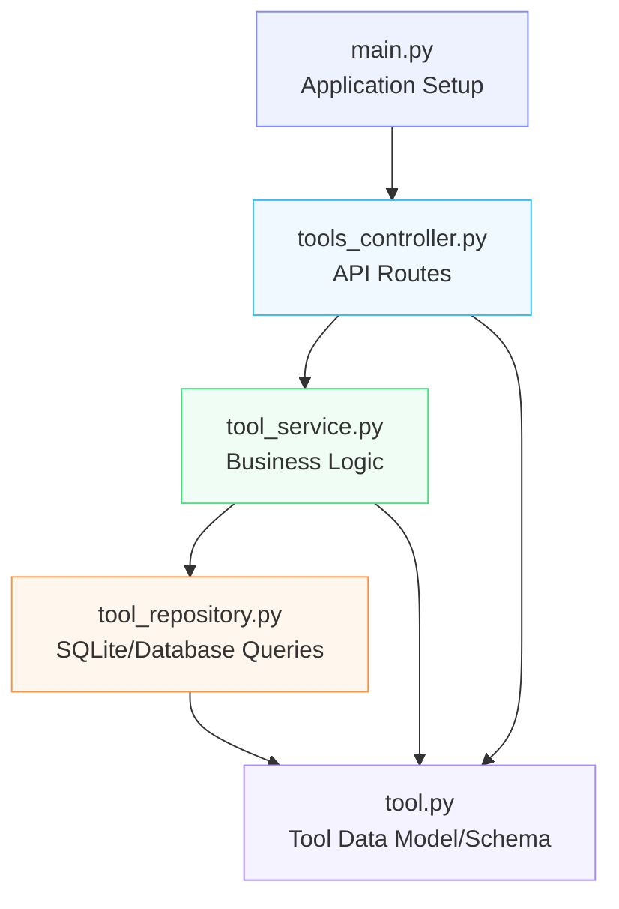

For FastAPI, I recommend a lightweight MVC structure:

```mermaid
graph TD;
    Main[main.py<br/>Application Setup]
    
    Controller[tools_controller.py<br/>API Routes]
    Model[tool.py<br/>Tool Data Model/Schema]
    Repository[tool_repository.py<br/>SQLite/Database Queries]
    Service[tool_service.py<br/>Business Logic]
    
    Main --> Controller
    Controller --> Service
    Service --> Repository
    Repository --> Model
    Service --> Model
    Controller --> Model
    
    classDef setup stroke:#818cf8,fill:#eef2ff
    classDef api stroke:#38bdf8,fill:#f0f9ff
    classDef logic stroke:#4ade80,fill:#f0fdf4
    classDef data stroke:#fb923c,fill:#fff7ed
    classDef model stroke:#a78bfa,fill:#f5f3ff
    
    class Main setup
    class Controller api
    class Service logic
    class Repository data
    class Model model
```

The request flow would be:

    HTTP request
  -> Controller
  -> Service
  -> Repository
  -> SQLite
  -> Controller response
